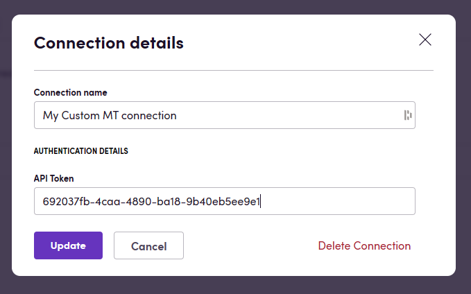
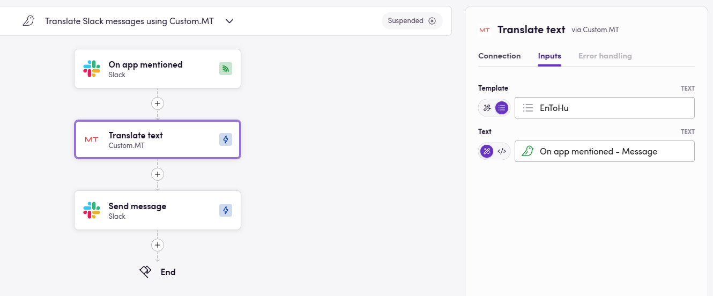

# Blackbird.io Custom.MT

Blackbird is the new automation backbone for the language technology industry. Blackbird provides enterprise-scale automation and orchestration with a simple no-code/low-code platform. Blackbird enables ambitious organizations to identify, vet and automate as many processes as possible. Not just localization workflows, but any business and IT process. This repository represents an application that is deployable on Blackbird and usable inside the workflow editor.

## Introduction

[Custom.MT](https://custom.mt/) offers fine-tuned language models for translation. It allows you to create machine translation templates and use them for automated translation. In Blackbird, you can use Custom.MT's templates in your localization pipelines for translating strings.

## Before setting up

Before you can connect you need to make sure that:

- You have a [Custom.MT account](https://console.custom.mt/).
- You have an API Key for Custom.MT, retrievable [here](https://console.custom.mt/credentials/).
- You have created at least one template [here](https://console.custom.mt/templates/).

## Connecting

1. Navigate to apps and search for Custom.MT. If you cannot find Custom.MT then click _Add App_ in the top right corner, select Custom.MT and add the app to your Blackbird environment.
2. Click _Add Connection_.
3. Name your connection for future reference e.g. 'My Custom MT connection'.
4. Copy your API Key from the Custom.MT console to the API Token field.
5. Click _Connect_

## Actions

- **Translate text**: Provide a dynamic template identifier or select your template from the list of existing templates. Add the text to be translated into the text field. This action returns the translation of the text using the provided template.
- **Translate multiple texts**: Same as the above, except with multiple texts as the input.

## Example

This example shows a very simple workflow where any incoming mention on particular channel is translated using the specified template _EnToHu_ and send back to the same channel as a response.

## Feedback

Feedback to our implementation of Custom.MT is always very welcome. Reach out to us using the established channels or create an issue.
